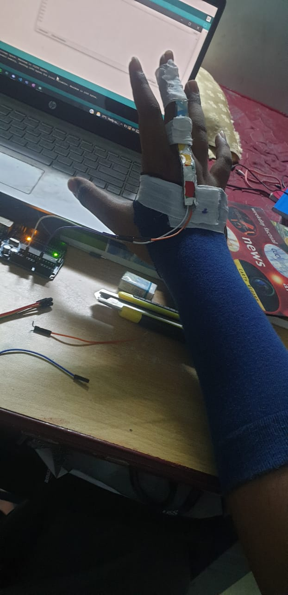
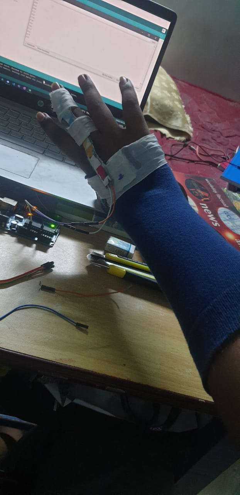
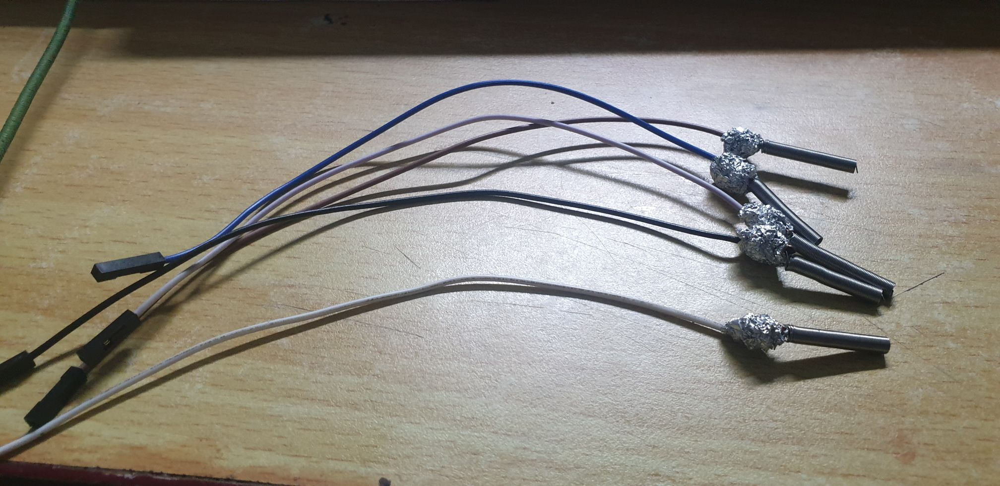
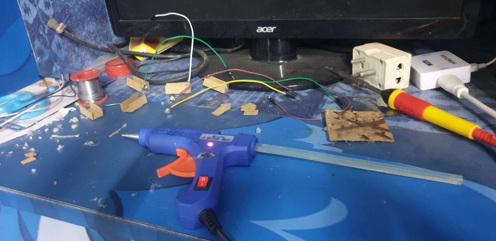
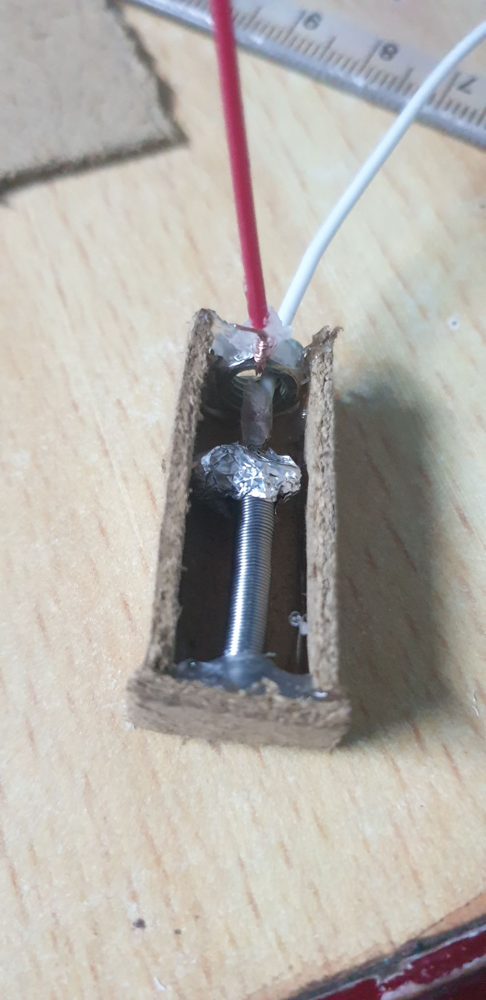
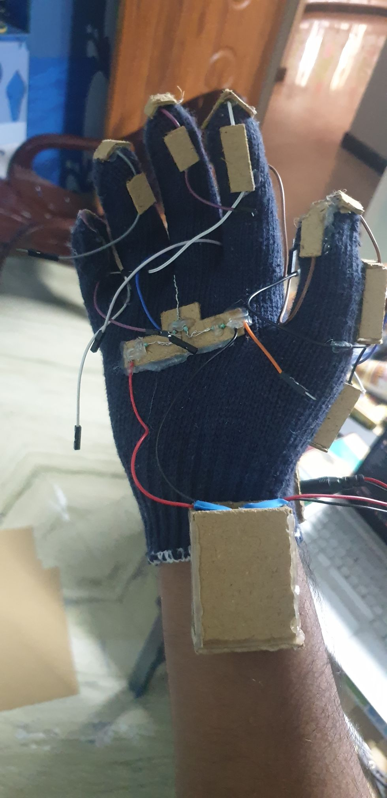
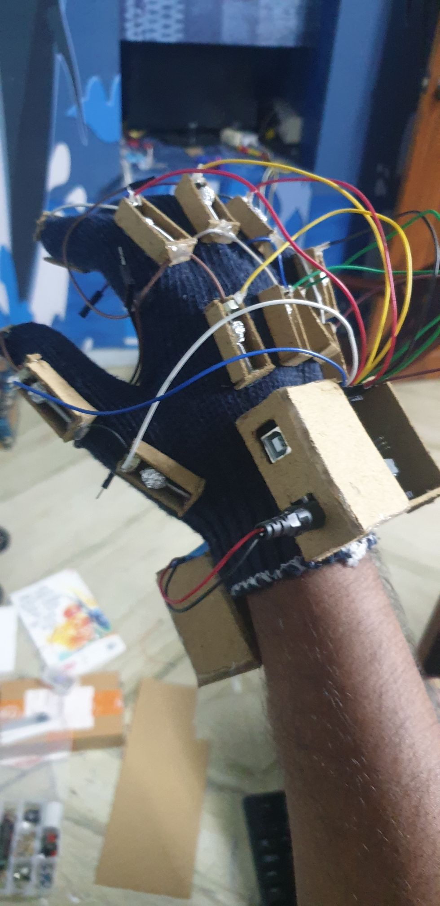

# Command gloves

Project to create a glove/a pair of gloves that can be used in several other projects as control input. Combinations of movements of individual fingers are used for controlling parameters of other projects. For example: lifting the index finger increases the brightness of the lights.

## 1. Prototype glove:
Arm band designed out of an old sock. Flex sensors I made at home in [another project](https://github.com/Roboramv2/Random-projects), are used here to read my finger movement. Fingers supported with loops made of old ribbons.

## 2. Final concept:
Actually bought a glove for this one. Replacing flex sensors with [pull sensor](https://github.com/Roboramv2/Random-projects) of my own design: digital, homemade. Attaching ten such sensors enables monitoring of ten individual joints, allowing greater variety of gesture combinations.

### Construction

### Result
